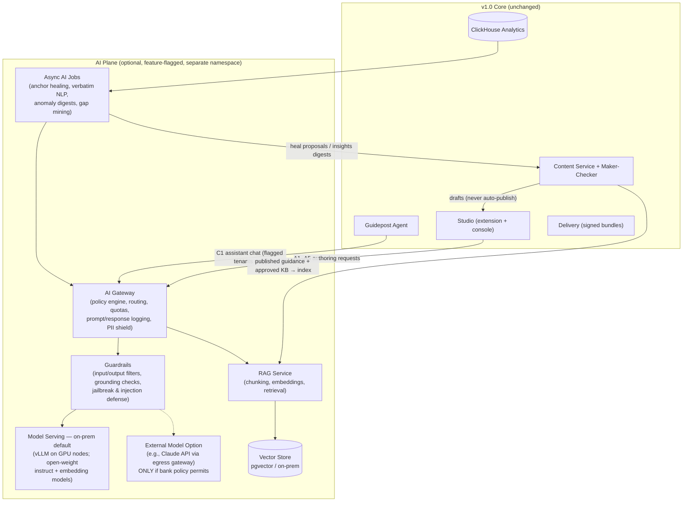

# StraightBank Digital Adoption Platform — Version 2.0 (AI-Augmented Edition)

**Document status:** Draft v2.0 for Architecture Review Board — companion to v1.0 (baseline architecture)
**Relationship to v1.0:** Purely **additive**. Everything in v1.0 remains the deterministic core. This version defines an **optional AI Plane** that can be enabled per tenant, per capability, per environment — or never enabled at all — depending on the bank's AI direction.

---

## 1. Positioning Statement

The v1.0 platform is deliberately deterministic: declarative content, signed bundles, rule-based targeting. That remains the production backbone. Version 2.0 answers a different question: *if the bank green-lights AI usage, where does intelligence create real value in digital adoption — and how do we add it without compromising the sovereignty, safety, and fail-open guarantees that motivated the in-house build in the first place?*

Three commitments govern the whole design:

1. **AI is optional and severable.** Every AI capability sits behind a per-tenant feature flag. With all flags off, the platform is byte-for-byte the v1.0 system. No AI component sits in the guidance rendering critical path.
2. **AI assists; humans and deterministic rules decide.** AI-generated content always enters the same maker-checker workflow as human-authored content. AI never publishes, never modifies live guidance, never executes actions in host apps autonomously.
3. **Sovereignty parity.** The default AI deployment is fully on-prem (open-weight models on bank GPU infrastructure). An external AI-gateway option exists only as a policy-controlled alternative if the bank's direction permits it — it is a configuration, not a dependency.

---

## 2. AI Capability Catalog

Capabilities are organized into three maturity tiers so the bank can adopt incrementally, and each maps to the concern it improves over both WalkMe and the v1.0 baseline.

### Tier 1 — ASSIST (authoring productivity; lowest risk; AI output always human-reviewed)

| # | Capability | What it does | Value |
|---|---|---|---|
| A1 | **Draft-from-document flow generation** | Author uploads an SOP/process doc or pastes a procedure; AI drafts a Flow skeleton (steps, copy, suggested anchor descriptions) into Studio as a *Draft* | Cuts authoring time 50–70%; converts the bank's existing SOP library into guidance at scale |
| A2 | **Step copy assistant** | Rewrite/shorten/adjust tone of step text; enforce bank tone-of-voice and plain-language standards; readability scoring | Consistent quality across dozens of authors and tenants |
| A3 | **AI-assisted translation** | LLM machine translation of the translation table into target locales (incl. Arabic), pre-filled into the existing per-locale review states; terminology glossary enforced | Days → hours per locale; human linguistic review retained |
| A4 | **Content QA copilot** | Pre-review checks: broken branch logic, unreachable steps, missing locales, non-compliant phrasing (e.g., unapproved product claims), accessibility of authored text | Raises checker efficiency; catches defects before review |
| A5 | **Draft-from-recording** | Author performs the journey once with the Studio extension in "record" mode; AI converts the captured click-stream + screens into a draft Flow with anchors already fingerprinted | The fastest possible path from expert knowledge to guidance |

### Tier 2 — ADVISE (runtime intelligence; AI informs, deterministic engine acts)

| # | Capability | What it does | Value |
|---|---|---|---|
| B1 | **Semantic anchor healing** | When the v1.0 multi-signal scorer drops below confidence, an offline AI job reasons over the captured DOM snapshot vs. the current page (accessibility tree + attributes) and proposes a repaired fingerprint into the Studio heal queue | Turns anchor drift from a manual chore into one-click approvals; directly attacks the #1 operational risk in §15 of v1.0 |
| B2 | **Struggle detection** | Lightweight on-device heuristics (rage clicks, field backtracking, repeated validation errors, idle-on-form) raise a *struggle signal*; the deterministic targeting engine decides whether a mapped Flow/Tip is offered | Proactive help without creepiness; signals are local, thresholds are rules |
| B3 | **Insights copilot** | Natural-language querying over the ClickHouse analytics ("why did step 3 completion drop last week?", "compare Arabic vs English funnel"), auto-generated weekly digest, anomaly detection on drop-offs and drift | Democratizes analytics beyond dashboard users |
| B4 | **Survey verbatim intelligence** | Thematic clustering, sentiment, and summarization of free-text survey responses per tenant/locale | Converts thousands of comments into ranked, actionable themes |
| B5 | **Guidance gap mining** | Correlates struggle signals and abandonment hotspots with the content inventory to recommend "you have no guidance where users struggle most" | Data-driven authoring backlog |

### Tier 3 — ACT (conversational & adaptive; highest value, enabled only with explicit bank direction)

| # | Capability | What it does | Value |
|---|---|---|---|
| C1 | **In-app guidance assistant** | A chat widget (rendered by the same agent, same Shadow DOM isolation): user asks "how do I reverse a payment?"; RAG over the tenant's published guidance + approved KB articles returns an answer and can **launch the matching Flow** on the live screen | The step-change over WalkMe: guidance becomes searchable by intent, not by hunting for launchers |
| C2 | **Adaptive guidance depth** | Per-user proficiency model (completions, tenure, error rates) selects between "full walk-thru", "tips only", or "no guidance" variants that authors define | Experts stop being nagged; novices get more support — with authors, not the model, defining the variants |
| C3 | **Conversational surveys** | Follow-up probing on survey answers ("you rated 3/10 — what went wrong?") within strict authored bounds | Richer VoC data |
| C4 | *(Explicitly out of scope)* | Autonomous form-filling / AI acting inside banking transactions | Rejected: violates the zero-harm principle; revisit only as a separate program with its own risk assessment |

---

## 3. AI Plane Architecture

### 3.1 Component notes

**AI Gateway** — the single choke point for every model call, bank-side. Enforces: per-tenant/per-capability enablement, model routing (on-prem vs external), token/cost quotas, full prompt+response audit logging to SIEM, and the **PII shield** (detection and redaction of customer identifiers before any prompt leaves the requesting service — mandatory even for on-prem models, non-negotiable for the external option).

**Model serving (default: on-prem)** — GPU node pool in the existing Kubernetes estate running vLLM with bank-approved **open-weight models** (a mid-size instruct model for generation/chat, a small model for classification/routing, and an embedding model for RAG). Model weights are vendored into the bank artifact repository like any other dependency — no runtime pulls. This keeps the ME-market/sovereignty posture identical to v1.0.

**External model option** — a routed alternative through the gateway (e.g., Anthropic API) usable only for capabilities and tenants the bank's AI policy explicitly allows, with the PII shield and no-training/zero-retention contractual terms as preconditions. Every capability in §2 is designed to work on on-prem models; external routing is a quality upgrade, never a requirement.

**RAG service + vector store** — indexes only *published* guidance content and explicitly approved knowledge-base articles per tenant (tenant-isolated collections). The C1 assistant is **grounded-only**: it answers exclusively from retrieved, cited tenant content; a grounding checker blocks uncited generations; when retrieval is empty it says so and offers the human support channel. It does not answer general banking questions.

**Guardrails** — layered: input classification (prompt-injection patterns, off-topic banking advice requests), output filters (toxicity, PII echo, unapproved product/rate claims), grounding verification for C1, and per-session rate limits. Guidance pages themselves are untrusted input to the assistant — DOM-derived context passed to models is treated as data, never instructions.

**Async AI Jobs** — B1/B3/B4/B5 run as batch/stream jobs against ClickHouse and content snapshots; their outputs land as *proposals* in Studio queues or as reports, never as direct state changes.

### 3.2 Fail-open, extended

The v1.0 fail-open guarantee extends to the AI Plane: if the gateway, models, or RAG are down or disabled, the agent renders v1.0 guidance normally; the C1 chat widget (if enabled) degrades to a static search over guidance titles; Studio AI buttons grey out. No AI outage can affect guidance delivery.

---

## 4. Deployment Additions

- **GPU pool:** initial sizing for Tier 1+2: 2 × GPU nodes (e.g., 2× L40S/A100-class each) in DC1, 1 in DC2 for failover — batch jobs tolerate single-DC operation. Tier 3 (C1 assistant at 60K-user scale) adds 2–4 nodes depending on adoption; the gateway's quota system caps concurrency until sizing is validated.
- **Isolation:** AI Plane runs in a dedicated namespace with its own network policy; the only ingress from the v1.0 planes is via the gateway API; the vector store and model pods have no route to host applications or the internet.
- **Environments:** AI features follow the same DEV→SIT→UAT→PROD promotion; model versions are pinned per environment and changed via the same GitOps flow as code.

---

## 5. Governance & Model Risk (bank-direction dependent)

| Concern | Control |
|---|---|
| AI usage policy alignment | Capability flags map 1:1 to policy decisions; the bank can adopt Tier 1 only, Tiers 1–2, or all three — or none. A signed-off **capability register** records what is on, where, and why. |
| Model risk management | Each capability gets a model card + intended-use statement; Tier 2/3 capabilities undergo the bank's model validation process (accuracy/grounding benchmarks, bias review for multi-locale output, periodic revalidation). |
| Human oversight | Tier 1: mandatory human review (existing maker-checker). Tier 2: AI proposes, rules/humans act. Tier 3: grounded-only answers with citations + visible "AI-generated" labelling + one-tap escalation to human support content. |
| Data protection | PII shield at the gateway; analytics already pseudonymous (v1.0 §8.2); prompts/outputs retained 13 months for audit then purged; per-jurisdiction disablement per tenant. |
| Auditability | Every AI interaction (who, capability, model+version, prompt hash, output hash, decision taken) in the append-only audit log → SIEM. |
| Regulatory posture | Capability register + risk tiering structured to align with emerging AI regulation (e.g., EU AI Act-style transparency and human-oversight expectations) and local ME regulator guidance; C1 assistant is scoped to *application usage help*, never financial advice — enforced by guardrails and stated in the UI. |
| Security | Prompt-injection defense (DOM/context treated as data), RAG index limited to approved content, model weights integrity-verified from the artifact repo, red-team exercises added to the annual pen test scope. |

---

## 6. What Changes for Users and Authors (before/after)

| Journey | v1.0 baseline | With AI (flags on) |
|---|---|---|
| Author a new flow | Manual: pick anchors, write copy, translate, review (~2–4 days) | A5 record journey → A1/A2 draft + copy → A3 translations pre-filled → same review (~0.5–1 day) |
| Host app release breaks anchors | Drift alert → author re-captures manually | B1 proposes healed fingerprints → checker one-click approves |
| User stuck on a screen | User must find a launcher or call support | B2 detects struggle → deterministic rule offers the mapped flow; or user asks C1 "how do I…?" and the flow launches |
| Ops lead reviews adoption | Reads dashboards | Asks B3 in plain language; receives weekly anomaly digest |
| Survey analysis | Manual reading of verbatims | B4 themes + sentiment ranked per locale |

---

## 7. Phased Adoption Path (each gate = bank decision point)

| Phase | Content | Gate to proceed |
|---|---|---|
| **AI-0** | Ship v1.0 with AI Plane interfaces stubbed (gateway API contract, flag framework, prompt-audit schema) — zero AI running | Bank AI policy direction confirmed |
| **AI-1** | Tier 1 (A1–A5) on on-prem models, Studio-only; measure authoring-time and translation-cost deltas | Model validation sign-off; measured value |
| **AI-2** | Tier 2 (B1–B5) batch/advisory capabilities | Drift-heal precision ≥ agreed threshold; insights adoption |
| **AI-3** | Tier 3 pilot: C1 assistant on one internal tenant (HR portal), grounded-only, labelled | Guardrail red-team pass; CSAT ≥ baseline; regulator/compliance comfort |
| **AI-4** | C1 on StraightBank + C2 adaptive depth | Scale/cost validation on GPU pool |

The stubs in AI-0 cost little and prevent retrofit pain; they create no obligation to ever enable AI.

---

## 8. Incremental Risks Introduced by the AI Plane

| Risk | Mitigation |
|---|---|
| Hallucinated guidance text reaching users | Tier 1 outputs are drafts inside maker-checker; C1 is grounded-only with citation enforcement and blocked-on-ungrounded policy |
| Prompt injection via page content or user chat | Context-as-data prompting, input classifiers, no tool/action execution from model output, red-teaming |
| GPU cost creep | Gateway quotas + per-tenant metering; batch tiers before interactive tiers; external routing (if permitted) as elastic overflow only by policy |
| Model/vendor drift (open-weight model deprecated) | Weights vendored and pinned; capability benchmarks re-run before any model swap; abstraction at the gateway keeps capabilities model-agnostic |
| Over-reliance: authors stop reviewing AI drafts carefully | Review SLAs + spot-audit sampling of published AI-assisted content; QA copilot (A4) flags anomalies rather than replacing checkers |
| Reputational/regulatory exposure from the assistant | Scope lock (usage help only), visible AI labelling, human-support escape hatch, jurisdiction-level disablement |

---

## 9. Decision Framework for the Bank

A one-page choice the ARB/AI committee can ratify independently of v1.0 delivery:

1. **Direction A — No AI (default):** run v1.0 forever; AI-0 stubs remain dormant. Nothing is lost.
2. **Direction B — Internal-productivity AI only:** enable Tier 1 (+ optionally Tier 2). AI touches authors and analysts, never end users. Lowest regulatory surface; captures most of the cost savings (authoring + translation).
3. **Direction C — Full AI-augmented adoption platform:** Tiers 1–3, on-prem models, phased per §7. Delivers the capability WalkMe now markets as its AI roadmap — owned, sovereign, and per-user-license-free.

My recommendation as architect: commit to **AI-0 stubs now** (near-zero cost, preserves optionality), target **Direction B within the first year** post-launch, and treat **Direction C as a gated pilot on an internal tenant** before any customer/StraightBank exposure.
